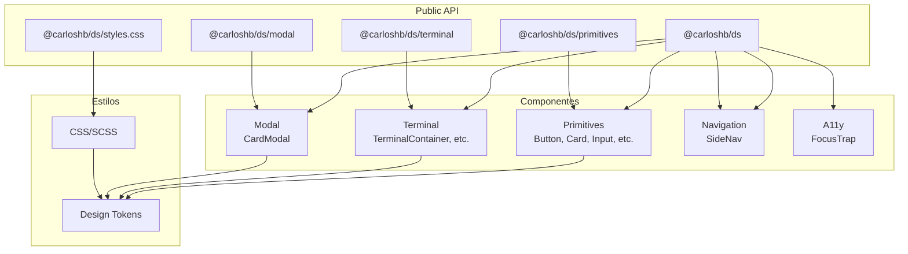
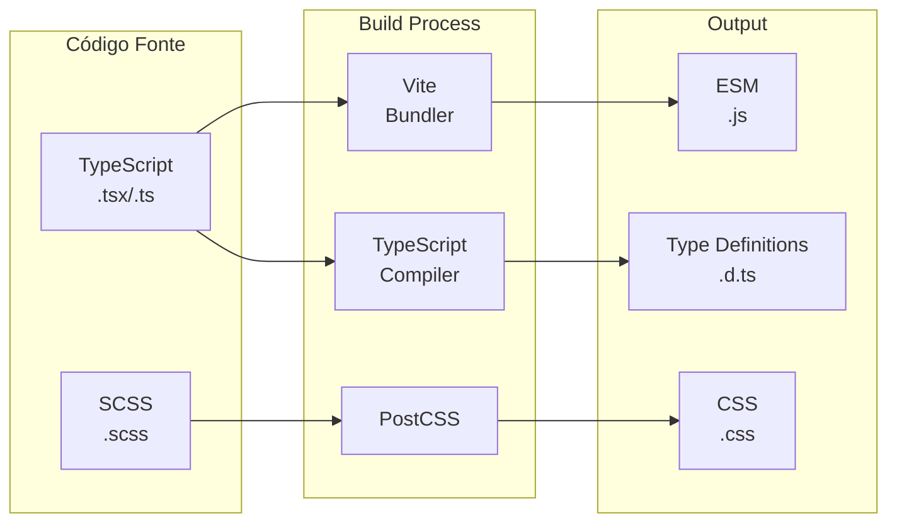
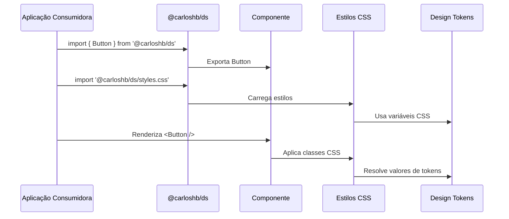

# Arquitetura da Biblioteca

Este documento descreve a arquitetura e decisões de design da biblioteca do Design System.

## Visão Geral

A biblioteca é estruturada como um pacote npm privado que exporta componentes React, tipos TypeScript e estilos CSS. Ela é construída usando:

- **TypeScript** para type safety
- **Vite** para bundling
- **React 19** como peer dependency
- **ESM** como formato de módulo

## Estrutura de Diretórios

```
ds/
├── src/
│   ├── components/        # Componentes React
│   │   └── ui/
│   │       ├── primitives/ # Componentes primitivos (Button, Input, etc.)
│   │       ├── terminal/  # Componentes de terminal
│   │       ├── modal/     # Componentes de modal
│   │       └── side-nav.tsx
│   └── public-api/        # API pública (exports principais)
├── dist/                  # Build output
│   ├── *.js              # Módulos JavaScript (ESM)
│   └── types/             # Declarações TypeScript
├── package.json
├── tsconfig.json
├── tsconfig.build.json
└── vite.lib.config.ts
```

## Sistema de Exports

A biblioteca usa o campo `exports` do `package.json` para definir a API pública:

### Export Principal (`.`)

```tsx
import { Button, Card, Alert } from 'ds';
```

Exporta todos os componentes através de `src/public-api/index.ts`.

### Exports Específicos

```tsx
import { Button } from 'ds/primitives';
import { TerminalContainer } from 'ds/terminal';
import { CardModal } from 'ds/modal';
```

Permite tree-shaking e importações mais específicas.

### Export de Estilos

```tsx
import 'ds/styles.css';
```

(Quando estilos forem migrados)

## Build System

### TypeScript

- **Desenvolvimento** (`tsconfig.json`): Configuração para IDE e type checking
- **Build** (`tsconfig.build.json`): Gera apenas declarações de tipos (`.d.ts`)

### Vite

- **Modo Library**: Configurado em `vite.lib.config.ts`
- **Formato**: ESM apenas (moderno, tree-shakeable)
- **External**: React e React-DOM são externos (peer dependencies)
- **Entry Points**: Múltiplos (index, primitives, terminal, modal)

## Dependências

### Peer Dependencies

- `react` ^19.0.0
- `react-dom` ^19.0.0

O consumidor deve fornecer React. Isso evita duplicação e permite flexibilidade de versão.

### Dependências de Desenvolvimento

Todas as dependências de build estão no root do projeto:

- TypeScript
- Vite
- @vitejs/plugin-react
- @types/react
- @types/react-dom

## Resolução de Imports

### Durante Desenvolvimento

O Storybook resolve imports `@/components/ui/*` para:

1. `ds/src/components/ui/*` (se `ds/` existe)
2. `src/components/ui/*` (fallback)

Isso permite desenvolvimento incremental sem quebrar o Storybook.

### Após Build

O consumidor importa da biblioteca:

```tsx
import { Button } from 'ds';
```

O bundler do consumidor resolve através do campo `exports` do `package.json`.

## Facade Pattern (Temporário)

Durante a migração, os módulos em `ds/src/components/ui/*` são facades que reexportam de `src/components/ui/*`:

```tsx
// ds/src/components/ui/primitives/button.tsx
export { Button, type ButtonProps } from '../../../../src/components/ui/primitives/button';
```

**Vantagens:**
- Permite testar a estrutura sem migrar código
- Storybook funciona imediatamente
- Migração pode ser gradual

**Desvantagens:**
- Dependência circular temporária
- Não é publishável até migração completa

## Migração de Componentes

### Fase 1: Estrutura (✅ Completo)

- Criar estrutura da biblioteca
- Configurar build
- Criar facades temporários

### Fase 2: Migração de Implementações (⏳ Em andamento)

- Migrar componentes de `src/components/ui/*` para `ds/src/components/ui/*`
- Migrar utilitários necessários (`cn`, `filterDOMProps`)
- Remover facades temporários

### Fase 3: Migração de Estilos (⏳ Pendente)

- Migrar tokens CSS de `src/index.css`
- Migrar estilos SCSS de `src/styles/*.scss`
- Configurar Tailwind na lib (ou documentar consumo)

### Fase 4: Integração (⏳ Pendente)

- Atualizar imports no app principal
- Remover código duplicado
- Publicar/versionar a lib

## Type Safety

### TypeScript Strict Mode

A biblioteca usa TypeScript em modo strict:

- `strict: true`
- `noUnusedLocals: true`
- `noUnusedParameters: true`

### Type Exports

Todos os tipos são exportados junto com os componentes:

```tsx
export { Button, type ButtonProps } from './button';
```

Isso permite type safety no consumidor.

## Tree Shaking

A estrutura de exports permite tree shaking eficiente:

- Exports específicos (`ds/primitives`) permitem importar apenas o necessário
- ESM format é otimizado para tree shaking
- Componentes são exportados individualmente

## Side Effects

CSS e SCSS são marcados como side effects no `package.json`:

```json
"sideEffects": ["**/*.css", "**/*.scss"]
```

Isso garante que estilos não sejam removidos durante tree shaking.

## Futuras Melhorias

1. **CSS-in-JS ou CSS Modules**: Considerar alternativas para estilos
2. **Storybook na lib**: Mover stories para dentro de `ds/`
3. **Testes unitários**: Adicionar Vitest/Jest
4. **CI/CD**: Automatizar build e publicação
5. **Versionamento**: Semver e changelog

## Diagrama de Arquitetura

### Estrutura de Componentes



### Fluxo de Build



### Fluxo de Dados



## Estrutura Detalhada de Pastas

```
carloshb-ds/
├── src/
│   ├── components/
│   │   ├── a11y/                    # Componentes de acessibilidade
│   │   │   └── FocusTrap.tsx
│   │   └── ui/
│   │       ├── primitives/          # Componentes primitivos
│   │       │   ├── alert.tsx
│   │       │   ├── badge.tsx
│   │       │   ├── button.tsx
│   │       │   ├── card.tsx
│   │       │   ├── checkbox.tsx
│   │       │   ├── container.tsx
│   │       │   ├── field.tsx
│   │       │   ├── input.tsx
│   │       │   ├── link-button.tsx
│   │       │   ├── radio.tsx
│   │       │   ├── section.tsx
│   │       │   ├── stepper.tsx
│   │       │   ├── text/            # Componentes de texto
│   │       │   │   ├── Heading.tsx
│   │       │   │   ├── Label.tsx
│   │       │   │   ├── Paragraph.tsx
│   │       │   │   ├── Text.tsx
│   │       │   │   └── index.ts
│   │       │   ├── textarea.tsx
│   │       │   └── index.ts
│   │       ├── terminal/            # Componentes de terminal
│   │       │   ├── terminal-container.tsx
│   │       │   ├── terminal-header.tsx
│   │       │   ├── terminal-body.tsx
│   │       │   ├── terminal-controls.tsx
│   │       │   ├── type-writer.tsx
│   │       │   └── index.ts
│   │       ├── modal/               # Componentes de modal
│   │       │   └── CardModal.tsx
│   │       └── side-nav.tsx        # Navegação lateral
│   ├── public-api/                  # API pública
│   │   └── index.ts                 # Export principal
│   ├── styles/                      # Estilos
│   │   ├── index.css
│   │   ├── index.ts
│   │   ├── a11y.scss
│   │   ├── animations.scss
│   │   ├── card-modal.scss
│   │   ├── side-nav.scss
│   │   ├── terminal.scss
│   │   └── skip-links.scss
│   ├── tokens/                      # Design tokens
│   │   └── index.ts
│   ├── types/                       # Tipos TypeScript
│   │   └── index.ts
│   └── utils/                       # Utilitários
│       └── index.ts
├── dist/                            # Build output
│   ├── index.js                    # Export principal (ESM)
│   ├── primitives.js               # Export primitives (ESM)
│   ├── terminal.js                 # Export terminal (ESM)
│   ├── modal.js                    # Export modal (ESM)
│   ├── styles.css                  # Estilos compilados
│   └── types/                      # Type definitions
│       ├── index.d.ts
│       └── ...
├── .storybook/                      # Configuração Storybook
├── docs/                            # Documentação
│   ├── README.md
│   ├── COMPONENTS.md
│   ├── DESIGN_TOKENS.md
│   ├── STYLING.md
│   ├── EXAMPLES.md
│   ├── ACCESSIBILITY.md
│   ├── PERFORMANCE.md
│   └── MIGRATION.md
├── package.json
├── tsconfig.json
├── tsconfig.build.json
├── vite.lib.config.ts
└── README.md
```

## Decisões de Design Arquitetural

### 1. ESM-Only

**Decisão**: Biblioteca é ESM-only (sem CommonJS)

**Razão**:
- Melhor tree-shaking
- Padrão moderno
- Suporte nativo em bundlers modernos

**Impacto**:
- Consumidores precisam usar bundlers modernos (Vite, Webpack 5+, etc.)
- Não funciona diretamente em Node.js sem configuração

### 2. Peer Dependencies

**Decisão**: React e React-DOM são peer dependencies

**Razão**:
- Evita duplicação de React no bundle
- Permite flexibilidade de versão
- Reduz tamanho do bundle

**Impacto**:
- Consumidor deve instalar React separadamente
- Versões devem ser compatíveis

### 3. Múltiplos Entry Points

**Decisão**: Exports separados por categoria (primitives, terminal, modal)

**Razão:
- Melhor tree-shaking
- Imports mais específicos
- Organização clara

**Impacto**:
- Consumidor pode importar apenas o que precisa
- Reduz bundle size final

### 4. TypeScript Strict Mode

**Decisão**: TypeScript configurado em modo strict

**Razão**:
- Type safety máximo
- Detecta erros em tempo de compilação
- Melhor experiência de desenvolvimento

**Impacto**:
- Código mais seguro
- Pode exigir mais anotações de tipo

### 5. CSS como Side Effect

**Decisão**: CSS marcado como side effect no package.json

**Razão**:
- Garante que estilos não sejam removidos durante tree-shaking
- Estilos são necessários para funcionamento dos componentes

**Impacto**:
- Estilos sempre incluídos quando importados
- Não pode ser tree-shaken

## Padrões de Código

### Estrutura de Componente

Todos os componentes seguem este padrão:

```tsx
// 1. Imports
import { forwardRef } from 'react';
import { cn } from '@/utils';

// 2. Types/Interfaces
export interface ComponentProps extends HTMLAttributes<HTMLElement> {
  variant?: 'default' | 'primary';
  size?: 'sm' | 'md' | 'lg';
}

// 3. Componente
export const Component = forwardRef<HTMLElement, ComponentProps>(
  ({ variant = 'default', size = 'md', className, ...props }, ref) => {
    return (
      <element
        ref={ref}
        className={cn(
          'base-classes',
          variantClasses[variant],
          sizeClasses[size],
          className
        )}
        {...props}
      />
    );
  }
);

Component.displayName = 'Component';
```

### Convenções de Nomenclatura

- **Componentes**: PascalCase (`Button`, `CardModal`)
- **Arquivos**: kebab-case (`button.tsx`, `card-modal.tsx`)
- **Props interfaces**: PascalCase + Props (`ButtonProps`)
- **Variantes**: camelCase em tipos (`'primary' | 'secondary'`)
- **Funções utilitárias**: camelCase (`cn`, `filterDOMProps`)

## Estrutura de Exports e Public API

### Export Principal

O arquivo `src/public-api/index.ts` é o ponto central de exports:

```tsx
// Primitives
export * from '../components/ui/primitives';

// Terminal
export * from '../components/ui/terminal';

// Modal
export { CardModal } from '../components/ui/modal/CardModal';

// Navigation
export { SideNav } from '../components/ui/side-nav';

// A11y
export { FocusTrap } from '../components/a11y/FocusTrap';
```

### Exports Específicos

Cada categoria tem seu próprio export:

- `@carloshb/ds/primitives` → `src/components/ui/primitives/index.ts`
- `@carloshb/ds/terminal` → `src/components/ui/terminal/index.ts`
- `@carloshb/ds/modal` → `src/components/ui/modal/CardModal.tsx`

## Testes

### Estrutura de Testes

```
src/
└── __tests__/
    ├── Button.test.tsx
    ├── Card.test.tsx
    ├── Alert.test.tsx
    └── ...
```

### Ferramentas

- **Vitest**: Framework de testes
- **React Testing Library**: Testes de componentes
- **Snapshots**: Testes de snapshot para regressão visual

## CI/CD

### Workflows GitHub Actions

1. **CI - Build and Test**: Executa em cada PR
   - Type checking
   - Build da biblioteca
   - Execução de testes

2. **GitHub Pages - Publish Storybook**: Publica Storybook
   - Executa após merge em master
   - Publica em GitHub Pages

3. **NPM Publish**: Publica pacote
   - Executa após release
   - Publica no NPM registry

## Versionamento

### Semver

A biblioteca segue Semantic Versioning:

- **MAJOR**: Breaking changes
- **MINOR**: Novas features (backward compatible)
- **PATCH**: Bug fixes (backward compatible)

### Changelog

Mudanças são documentadas em:
- GitHub Releases
- CHANGELOG.md (futuro)

## Recursos Adicionais

- [README](./README.md) - Visão geral
- [Desenvolvimento](./DEVELOPMENT.md) - Setup local
- [Contribuição](./CONTRIBUTING.md) - Como contribuir
- [Publicação](./PUBLISHING.md) - Processo de release
